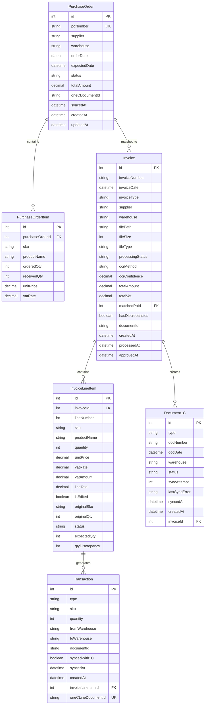

# Invoice Processing Schema

This document describes the database schema added for the invoice processing workflow: purchase orders, invoices, line items, and their links to existing 1C documents and transactions.

## Data Flow Overview

1. **Purchase orders** (from 1C or manual) are stored in `purchase_orders` with line items in `purchase_order_items`.
2. **Invoices** (uploaded files, OCR-extracted or manual) are stored in `invoices` with line items in `invoice_line_items`.
3. An invoice can be **matched** to a purchase order (`invoices.matched_po_id`). Line items can track expected vs actual quantities (`expected_qty`, `qty_discrepancy`).
4. When an invoice is **approved**, a 1C document is created and linked via `documents_1c.invoice_id`.
5. **Transactions** created from invoice lines are linked via `transactions.invoice_line_item_id` and can store `one_c_line_document_id` for idempotent retry.

## New Tables

| Table | Purpose |
|-------|---------|
| `purchase_orders` | PO header: number, supplier, warehouse, dates, status (open/partial/fulfilled/cancelled). |
| `purchase_order_items` | PO lines: SKU, ordered/received qty, unit price, VAT. `received_qty` enables partial delivery tracking. |
| `invoices` | Invoice header: number, type (TORG12/TTN/INVOICE), file path, OCR metadata, processing status. |
| `invoice_line_items` | Invoice lines: quantity, prices, VAT, and flags for user edits and PO comparison. |

## Key Fields

- **`invoices.processingStatus`** — Workflow: `pending` → `processing` → `review` → `approved` → `completed` or `failed`.
- **`purchase_order_items.receivedQty`** — Tracks how much has been received per line; supports partial deliveries.
- **`invoice_line_items.isEdited`** — Indicates the user corrected OCR (e.g. SKU or quantity); `originalSku` / `originalQty` store pre-edit values.
- **`invoice_line_items.expectedQty`** / **`qtyDiscrepancy`** — From PO match; used to highlight mismatches.
- **`invoices.hasDiscrepancies`** — Set when any line has a quantity or other mismatch vs the matched PO.
- **`transactions.oneCLineDocumentId`** — 1C line document ID for the transaction; used to avoid creating duplicate transactions on retry.

## Extended Tables

- **`documents_1c`** — New optional `invoice_id` links a 1C document created from invoice approval back to the source invoice.
- **`transactions`** — New optional `invoice_line_item_id` and `one_c_line_document_id` for traceability and idempotency.

## Relationships

- `PurchaseOrder` → many `PurchaseOrderItem`
- `Invoice` → many `InvoiceLineItem`; optional many-to-one to `PurchaseOrder` (matched PO)
- `Document1C` → optional `Invoice` (created from this invoice)
- `Transaction` → optional `InvoiceLineItem` (created from this line)

## Schema diagram



| Parent Table        | Child Table        | Relationship Type | Foreign Key           | Cascade Behavior |
|---------------------|--------------------|-------------------|------------------------|------------------|
| `PurchaseOrder`     | `PurchaseOrderItem`| One-to-Many       | `purchaseOrderId`      | RESTRICT         |
| `PurchaseOrder`     | `Invoice`          | One-to-Many       | `matchedPoId`          | SET NULL         |
| `Invoice`           | `InvoiceLineItem`  | One-to-Many       | `invoiceId`            | RESTRICT         |
| `Invoice`           | `Document1C`       | One-to-Many       | `invoiceId`            | SET NULL         |
| `InvoiceLineItem`   | `Transaction`      | One-to-Many       | `invoiceLineItemId`    | SET NULL         |

## Migration

- Migration: `20250203120000_add_invoice_and_purchase_order_tables`
- Apply with `DATABASE_URL` set: `npx prisma migrate deploy` (production) or `npm run db:migrate` (development).
- Regenerate client after schema changes: `npm run db:generate`.

## Rollback

To revert the invoice/PO schema (e.g. after a failed deployment):

1. **Back up the database** before running any rollback.
2. Run the rollback SQL script against the target database:
   ```bash
   psql "$DATABASE_URL" -f scripts/rollback-invoice-po-migration.sql
   ```
3. Revert the Prisma schema and migration folder in version control to the state before `20250203120000_add_invoice_and_purchase_order_tables`.
4. Run `npm run db:generate` so the Prisma client matches the reverted schema.

The script `scripts/rollback-invoice-po-migration.sql` drops FKs on `transactions` and `documents_1c`, removes the new columns, then drops `invoice_line_items`, `invoices`, `purchase_order_items`, and `purchase_orders` in that order.

## Common Queries (for developers)

- **Invoices by status** (uses `invoices_processing_status_idx`):  
  `prisma.invoice.findMany({ where: { processingStatus: 'pending' } })`
- **Invoices by supplier** (uses `invoices_supplier_idx`):  
  `prisma.invoice.findMany({ where: { supplier: 'Acme Corp' } })`
- **Invoice with line items and matched PO** (3-table join):  
  `prisma.invoice.findMany({ include: { lineItems: true, matchedPo: true } })`
- **Purchase orders by supplier** (uses `purchase_orders_supplier_idx`):  
  `prisma.purchaseOrder.findMany({ where: { supplier: 'Acme Corp' }, include: { items: true } })`
- **Line items by SKU** (uses `invoice_line_items_sku_idx`):  
  `prisma.invoiceLineItem.findMany({ where: { sku: 'SKU-001' } })`
